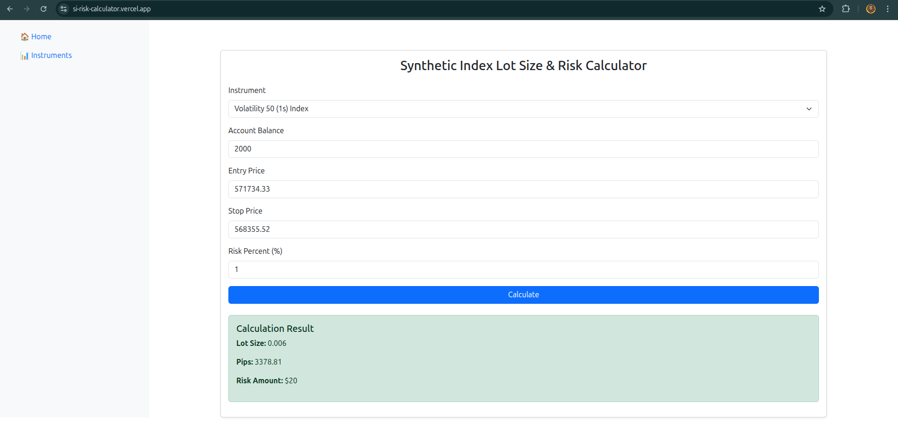

# Synthetic Indices Position Size Calculator


## 📌 About

This is a risk calculator for Deriv's Synthetic Indices. It calculates the lot size, number of pips and the total risk (USD) for a user's trade based on these parameters:

- The pair chosen.
- Account Balance
- Entry price
- Stop loss price
- Percentage Risk (%)

[Deriv](https://deriv.com/) is an online broker that offers CFDs and other derivatives on forex, stocks & indices, cryptocurrencies, commodities, and derived to millions of registered users across the globe.

This project also includes an API for the calculator. The documentation is in the file ```./SI_RC/api.md```.

## 🛠 Setup & Installation

1. Clone the repository locally

    ```bash
    git clone https://github.com/LionelMv/SI-Calculator.git
    ```

2. Setup a virtual environment using pip and venv.
    ```bash
    python -m venv env
    ```

3. Activate the virtual environment.

    On Windows:

    ```bash
    .\env\Scripts\activate
    ```

    On Linux/MacOS:
    ```bash
    source env\Scripts\activate
    ```

4. Setup the project environment

    ```bash
    pip install -r requirements.txt
    ```

5. Start up server

    ```bash
    python manage.py runserver
    ```

    The application should be available at ```http://localhost:8000/``` through your browser.

## 🌐 API Endpoints
**Base URL:** `https://base_url/api/`
| Endpoint | Method | Description |
|----------|--------|-------------|
| `/calculate/` | POST | Return the lot size, pips and risk amount |
| `/instruments/` | GET | Get all the instruments and their minimum lot size  |

## 📘 The Story

Most professional traders always manage their risk for every trade position they enter be it in stocks, forex and even other investments. Synthetic Indices' trading is not any different.

While for stocks and forex there are good risk calculators that you can calculate the lot sizes easily and risk for each trade, no efficient risk calculators have been developed for synthetic indices. Many calculators developed require a user to calculate the pip value for each instrument and then feed the value to the calculator. This is a pain to a user since every instrument has different pip value. All calculators so far also do not offer a way to calculate lot size based on the risk you would like for each trade. In an industry where time is key when taking a trade, this was very inefficient. This brought the need for a risk calculator that you could easily calculate your lot size and risk based on your entry price and stop price.

While it looked easy on paper to implement, each instrument having different minimum lot sizes that you can trade posed a challenge. Creating the logic to fit the calculations well and letting no room for error (since this is people's money we are playing with) led to every day creating many logical mathematical calculations and python functions before getting the simplified template that is this project.

---

## 🤝 Contribution Guide

1. **Fork/Clone the repository**
2. **Create a new branch:** `git checkout -b feature-branch`
3. **Commit changes with conventional commit messages:**
  
    ```sh
    git commit -m "feat: add user profile page"
    ```
  
4. **Push changes & create a pull request:**
  
    ```sh
    git push origin feature-branch
    ```

---
📌 **Deployed Application:** [SI Calculator](https://si-risk-calculator.vercel.app/)

---

## 👥 Authors

- Lionel Mwangi, [LinkedIn](https://www.linkedin.com/in/lionelmwangi/)